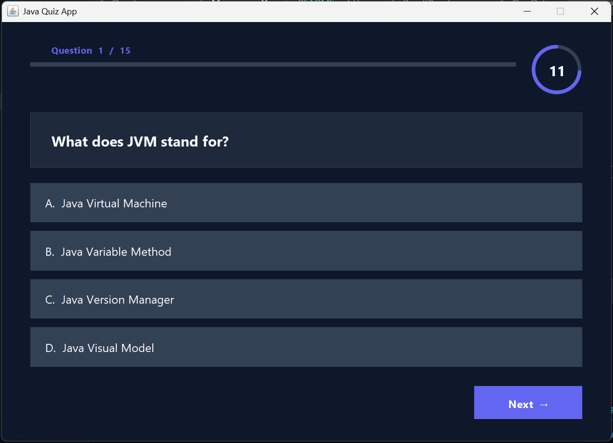
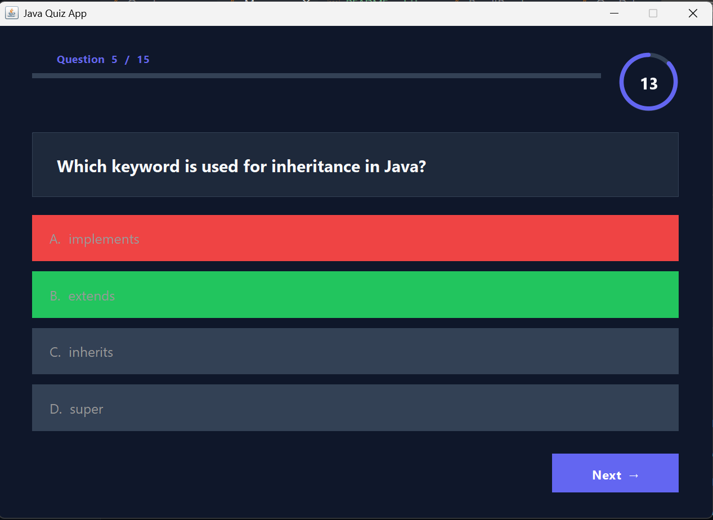
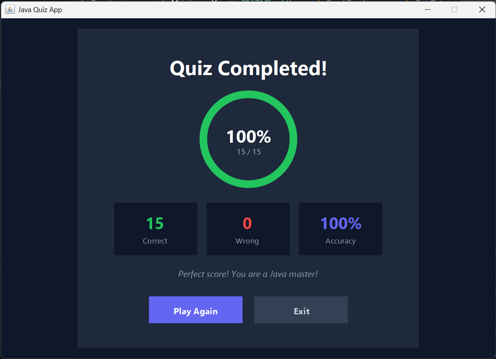

## Intern ID: CITS1037
# Java Quiz Application

A GUI-based Java Quiz App built with Java Swing, featuring a dark-themed UI, countdown timer, instant answer feedback, and an animated result screen.

---

## Features

- 15-second countdown timer per question with color warning
- Instant answer feedback — correct answer highlights green, wrong highlights red
- Progress bar showing how far through the quiz you are
- Animated result screen with score, accuracy and stats
- Play Again option without restarting the app
- Modern dark UI built entirely with Java Swing

---

## Project Structure

```
Quiz Application/
└── src/
    ├── Main.java
    ├── model/
    │   └── Question.java
    ├── data/
    │   └── QuizData.java
    └── ui/
        ├── QuizFrame.java
        └── ResultPanel.java
```

---

## How to Run

### Prerequisites
- Java JDK 8 or higher installed
- Any Java IDE (VS Code, IntelliJ IDEA, Eclipse)

### Steps

1. Clone the repository
   ```bash
   git clone https://github.com/RishabhSharma7818/Java-Quiz-Application.git
   ```

2. Open the project folder in VS Code or any Java IDE

3. Run `Main.java` to launch the application

---

## Screenshots




---

## Tech Stack

| Technology | Usage |
|---|---|
| Java | Core programming language |
| Java Swing | GUI framework |
| AWT | Layout and graphics |

---

## Topics Covered in Quiz

- JVM and Java basics
- OOP concepts (Inheritance, Encapsulation, Polymorphism)
- Collections (ArrayList, HashSet)
- Access modifiers
- Exception handling
- Loops, keywords and data types

---

## Author

**Rishabh Sharma**  
[GitHub](https://github.com/RishabhSharma7818)
